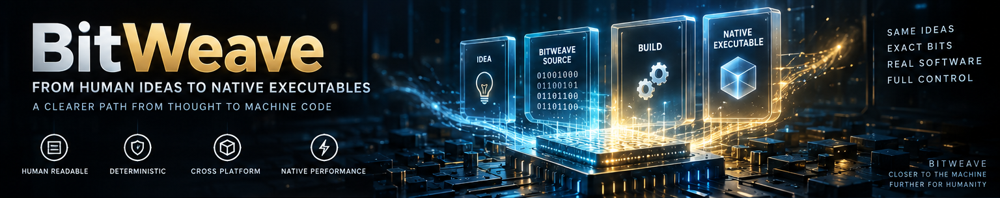
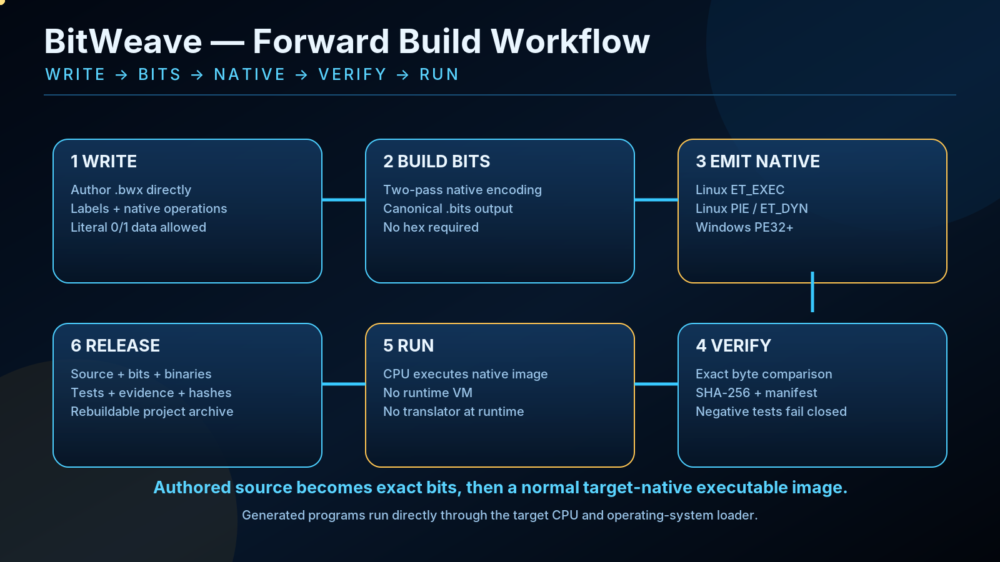
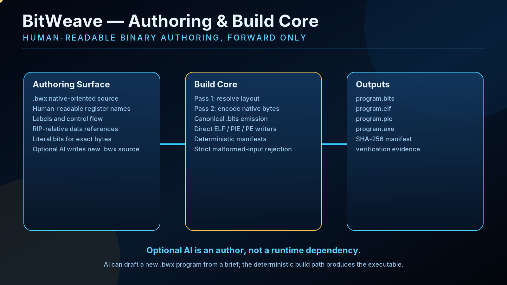
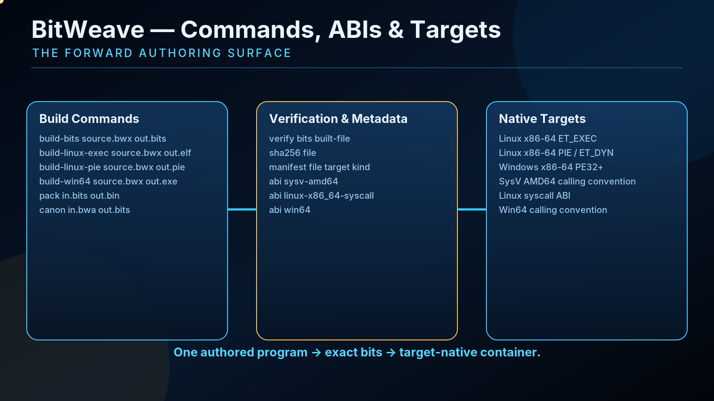
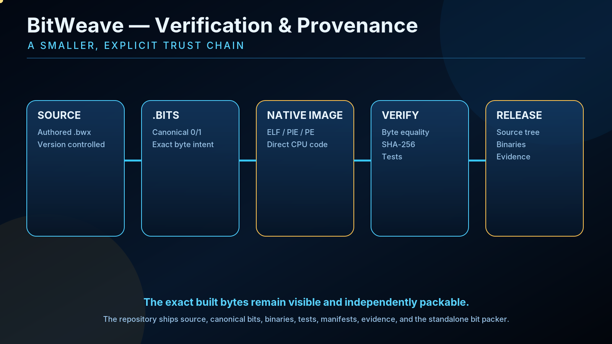

BitWeave

<p align="center">
  
</p>

**BitWeave is a forward native binary authoring engine.**

Programs are written in `.bwx`, deterministically encoded into canonical `0/1` bitstreams, and built as normal native executables for the selected target.

There is no runtime VM and no translation layer inside the generated program.

## Forward workflow

<p align="center">
  
</p>

```text
.bwx source
    ↓
build-bits
    ↓
canonical .bits
    ↓
ELF / PIE / PE32+
    ↓
verify + SHA-256 + manifest
    ↓
native executable
    ↓
direct execution on target
```

BitWeave starts with software authored in the project and builds forward toward native execution.

## Authoring and build core

<p align="center">
  
</p>

The `.bwx` authoring format supports labels, calls, jumps, conditional control flow, native x86-64 register operations, arithmetic and logic, shifts, comparisons, RIP-relative data references, embedded data, and literal `bits ...` lines for exact byte patterns.

Optional local AI can help author a new `.bwx` program from a brief. It is not required to build or run BitWeave programs.

## Commands, ABIs and targets

<p align="center">
  
</p>

```text
build-bits <source.bwx> <out.bits>
build-linux-exec <source.bwx> <out.elf> [out-full.bits]
build-linux-pie <source.bwx> <out.pie> [out-full.bits]
build-win64 <source.bwx> <out.exe> [out-full.bits]
pack <in.bits> <out.bin>
canon <in.bwa> <out.bits>
verify <in.bits> <built-file>
sha256 <file>
manifest <file> [target] [kind]
abi <sysv-amd64|linux-x86_64-syscall|win64>
ai-author-prompt <brief.txt>
```

Implemented native containers:

- Linux x86-64 `ET_EXEC`
- Linux x86-64 PIE / `ET_DYN`
- Windows x86-64 PE32+

## Canonical `.bits`

A `.bits` file contains only `0`, `1`, and whitespace.

Every eight bits represent exactly one byte.

```text
10111000 00101010 00000000 00000000 00000000
```

This keeps the exact binary representation inside the project instead of making it visible only after compilation.

## Verification and provenance

<p align="center">
  
</p>

A project can keep together:

```text
.bwx source
canonical .bits
hashes
tests
native target information
```

Verification checks that the packed output matches the canonical bitstream exactly.

```bash
./build/bitweave verify hello.bits hello
./build/bitweave sha256 hello
./build/bitweave manifest hello linux-x86_64 pie
```

## Trust model

BitWeave is influenced by the same class of problems discussed in Ken Thompson's **Reflections on Trusting Trust**.

Readable source alone does not describe every transformation between a program and the bytes eventually executed by the CPU.

BitWeave keeps an exact canonical binary representation alongside the authoring source so the path remains explicit:

```text
authoring
   ↓
canonical bits
   ↓
exact bytes
   ↓
native executable
```

This does not remove every trust problem in computing. It makes the binary construction path smaller, more explicit and easier to reproduce.

## Build

```bash
cmake -S . -B build
cmake --build build -j
./build/bitweave --version
```

Build a Linux PIE:

```bash
./build/bitweave build-linux-pie examples/hello.bwx hello
./hello
```

Build canonical bits first:

```bash
./build/bitweave build-bits examples/hello.bwx hello.bits
./build/bitpack hello.bits hello.bin
```

## Test

```bash
cmake -S . -B build -DCMAKE_BUILD_TYPE=Release
cmake --build build --parallel
ctest --test-dir build --output-on-failure

tests/test.sh build/bitweave build/bitpack
tests/negative.sh build/bitweave build/bitpack
python3 tests/all_bytes.py build/bitweave build/bitpack
tests/authoring_matrix.sh build/bitweave
```

## Repository layout

```text
src/          BitWeave and bitpack implementation
canonical/    canonical .bits representations
examples/     BitWeave programs and binary source examples
tests/        functional, negative and deterministic tests
docs/         architecture, formats, APIs, ABIs and provenance
assets/       static project diagrams
```

## Documentation

- [`docs/ARCHITECTURE.md`](docs/ARCHITECTURE.md)
- [`docs/API.md`](docs/API.md)
- [`docs/ABI.md`](docs/ABI.md)
- [`docs/BINARY_SOURCE.md`](docs/BINARY_SOURCE.md)
- [`docs/PROVENANCE.md`](docs/PROVENANCE.md)
- [`docs/TESTING.md`](docs/TESTING.md)
- [`docs/VISUALS.md`](docs/VISUALS.md)

## License

See [`LICENSE`](LICENSE).
