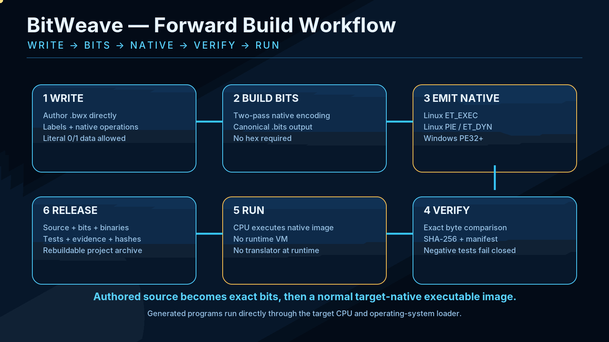
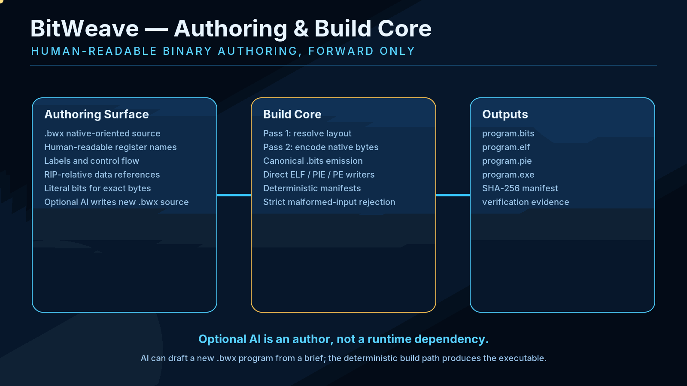
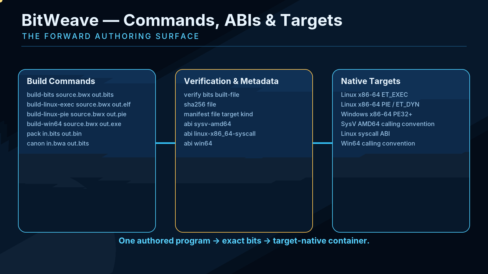
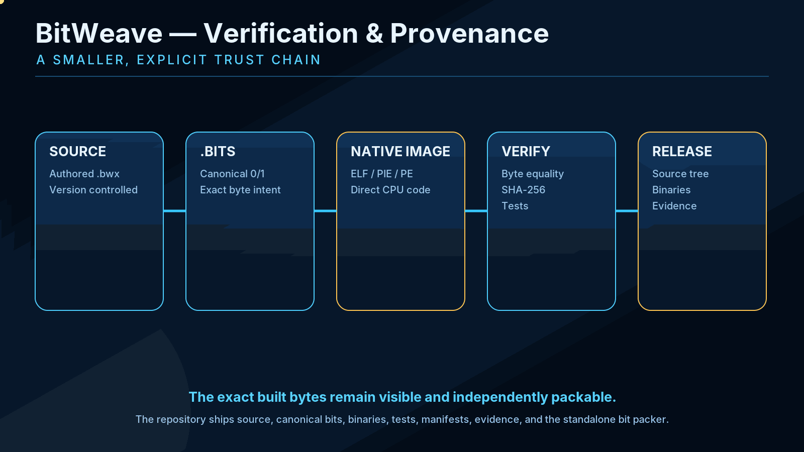

# BitWeave

<p align="center">
  <a href="assets/hero.png"></a>
</p>

**BitWeave is a forward-only native binary authoring engine.** You write new software in a human-readable, binary-oriented `.bwx` source, BitWeave deterministically encodes it to canonical `0/1` bits, and it emits normal native executable containers for the selected target.

There is no runtime VM and no translation layer inside the generated program.

## Forward workflow

<p align="center">
  <a href="assets/workflow.png"></a>
</p>

```text
new .bwx source
      ↓
build-bits
      ↓
canonical .bits
      ↓
ELF / PIE / PE writer
      ↓
verify + SHA-256 + manifest
      ↓
native executable
      ↓
run directly on target
```

BitWeave does **not** require a pre-built application as input. The normal path starts with source authored inside the project.

## Authoring and build core

<p align="center">
  <a href="assets/authoring.png"></a>
</p>

The `.bwx` authoring surface provides labels, control flow, native register operations, RIP-relative data references, arithmetic/logic operations, and literal `bits ...` lines when an exact byte pattern is desired.

Optional local AI can help **write a new `.bwx` program from a brief**. AI is not linked into the runtime and is not required to build or run anything.

## Commands, ABIs, and targets

<p align="center">
  <a href="assets/api-targets.png"></a>
</p>

Main forward commands:

```text
build-bits <source.bwx> <out.bits>
build-linux-exec <source.bwx> <out.elf> [out-full.bits]
build-linux-pie <source.bwx> <out.pie> [out-full.bits]
build-win64 <source.bwx> <out.exe> [out-full.bits]
pack <in.bits> <out.bin>
canon <in.bwa> <out.bits>
verify <in.bits> <built-file>
sha256 <file>
manifest <file> [target] [kind]
abi <sysv-amd64|linux-x86_64-syscall|win64>
ai-author-prompt <brief.txt>
```

Implemented native containers:

- Linux x86-64 `ET_EXEC`
- Linux x86-64 PIE / `ET_DYN`
- Windows x86-64 PE32+

## Verification and provenance

<p align="center">
  <a href="assets/verification.png"></a>
</p>

The repository keeps the reviewable inputs together: implementation source, canonical `.bits`, forward-authoring examples, tests, documentation, GitHub-native visuals, and CI definitions. Generated binaries and verification logs are produced by CI or release builds rather than committed to the source tree.

The `.bits` representation contains only `0`, `1`, and whitespace. Every group of eight bits maps to one byte.

## Build

```bash
cmake -S . -B build
cmake --build build -j
./build/bitweave --version
```

Example:

```bash
./build/bitweave build-linux-pie examples/hello.bwx hello
./hello
```

## Test

```bash
cmake -S . -B build -DCMAKE_BUILD_TYPE=Release
cmake --build build --parallel
ctest --test-dir build --output-on-failure

tests/test.sh build/bitweave build/bitpack
tests/negative.sh build/bitweave
python3 tests/all_bytes.py build/bitweave build/bitpack
tests/authoring_matrix.sh build/bitweave
```

GitHub Actions runs the same forward-build checks with GCC and Clang, plus a separate ASan/UBSan job. Captured CI logs and generated binaries are intentionally not committed to the source tree.

## Repository layout

- `src/` — BitWeave and standalone bitpack source
- `canonical/` — canonical bitstream snapshots of the tools
- `examples/` — forward-authored source examples
- `tests/` — automated forward-build and fail-closed tests
- `docs/` — architecture, API, ABI, binary source, AI authoring, provenance, visuals
- `.github/workflows/` — clean CI build/test definitions
- `assets/` — animated and static GitHub-native study graphics

See [`docs/API.md`](docs/API.md), [`docs/ARCHITECTURE.md`](docs/ARCHITECTURE.md), [`docs/TESTING.md`](docs/TESTING.md), and [`docs/PROVENANCE.md`](docs/PROVENANCE.md) for exact details.
